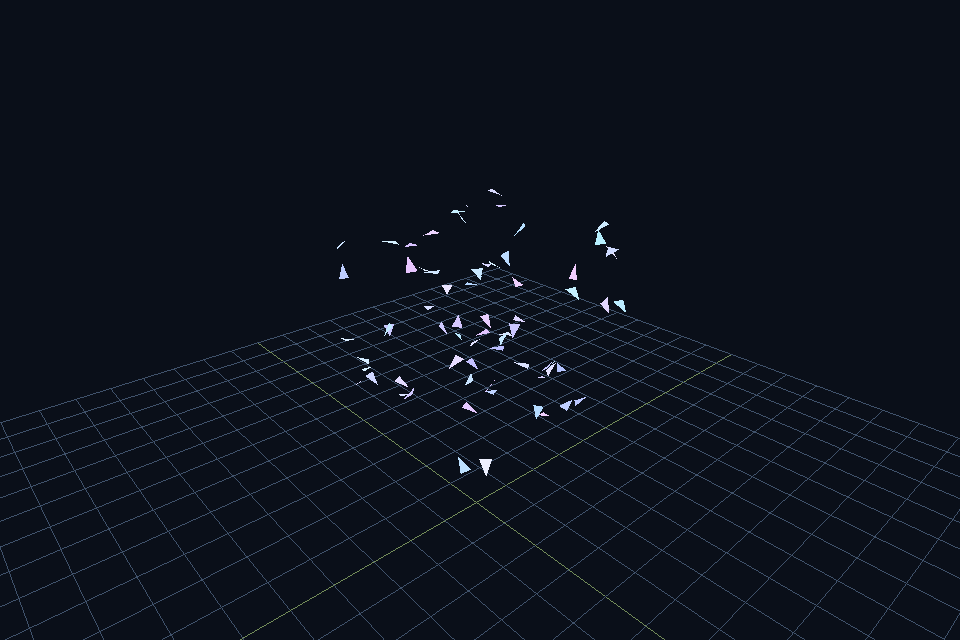

# breve

<p align="center">
  <strong>The difference isn’t another physics library.</strong><br />
  <strong>It’s a browser you open — and a 3D multi-agent world is already running.</strong>
</p>

<p align="center">
  <a href="#the-web-ui--why-this-repo-is-different"></a>
  <a href="https://github.com/jonklein/breve"></a>
</p>

<p align="center">
  
  
  
</p>

<p align="center">
  
</p>

<p align="center">
  <em>Type a world in English · or click a curriculum demo · watch continuous 3D agents live</em><br />
  Modern revival of <a href="https://github.com/jonklein/breve">Jon Klein’s breve</a> (2000–2015)
</p>

---

## The Web UI — why this repo is different

Most “multi-agent” tools force a choice:

| Tool | Reality |
|------|---------|
| **NetLogo / Mesa** | Brilliant — mostly **2D / grids** |
| **Unity / MuJoCo / Isaac** | Powerful — **heavy** install & authoring |
| **ChatGPT + paste code** | Clever — **no live world**, broken scripts |
| **Particle Life toys** | Pretty — not *your* scene from language |

**breve’s product is the opposite friction:**

```text
  Open a URL
       → a 3D world is ALREADY moving (no empty canvas)
       → click Gravity / Stairs / Wrecking ball / Flock
       → or describe a scene in English (Grok builds safe JSON)
       → orbit, pause, refine, Share a link
```

That loop is what makes this revival worth starring — not nostalgia for 2007 C++.

| Web UI capability | Why it matters |
|-------------------|----------------|
| **Autoplay on load** | Zero-second “aha” — gravity & mass before you read a doc |
| **Curriculum chips** | Teaching path without writing code |
| **Chat → scene** | Natural language composition; model emits **JSON only** (no `exec`) |
| **Live three.js view** | Drag to orbit, scroll zoom, pause/reset |
| **Share links** | `/?example=…` or `/?s=…` so demos spread |
| **Optional API key** | Examples work offline from AI; paste [xAI](https://console.x.ai) key when you want to invent worlds |

> **This is not “yet another boids gist.”**  
> It’s a **browser-native continuous 3D multi-agent sandbox** with an AI door on the front.

---

## Try the product in 60 seconds

```bash
git clone https://github.com/imcmurray/breve.git
cd breve
python3 -m venv .venv && source .venv/bin/activate
pip install -e ".[webai]"
breve-web
```

**→ [http://127.0.0.1:8765](http://127.0.0.1:8765)**

No API key required for demos. Optional:

```bash
export XAI_API_KEY=xai-...   # https://console.x.ai
```

Then in the UI: *“heavy red ball and light yellow balls so I can see gravity”* → **Build scene**.

Deploy for others: **[DEPLOY.md](DEPLOY.md)** (Docker / Fly / Railway).

---

## What people actually do in the UI

1. **Land** — heavy vs light balls already falling  
2. **Curriculum** — Stairs · Wrecking ball · Flock (one click)  
3. **Share** — copy a link; classmate opens the same world  
4. **Invent** — paste xAI key, describe a scene, refine in chat  
5. **Learn** — free-fall looks the same; **collisions** reveal mass  

That’s the teaching and demo story. The Python engine underneath is how it’s honest and extensible — not the first thing you must learn.

---

## Architecture (why AI is safe here)

```text
  English  ──►  Grok (xAI)  ──►  scene JSON  ──►  breve physics / flock
                                                      │
                                                      ▼
                                              browser (three.js)
```

- No arbitrary model code execution  
- Schema: `python/breve/scene.py`  
- Engine steps on the server; browser renders state over WebSocket  

---

## For developers (same spirit as classic breve)

```python
import breve
from breve.engine import Engine, set_engine

set_engine(Engine())

class Hello(breve.Control):
    def iterate(self):
        print("Hello, world!")
        super().iterate()

Hello().run(steps=5)
```

```bash
pip install -e ".[dev,viz]"
pytest -q
python demos/swarm.py --viz
python demos/bouncy.py --viz
```

| Layer | Path |
|-------|------|
| Web app | `breve-web` → `python/breve/webapp.py` + `web_static/` |
| Scene JSON | `scenes/` · builder `python/breve/scene.py` |
| AI | `breve-ai` · `python/breve/ai_llm.py` |
| Engine | `python/breve/` |
| Original sources | `legacy/` (museum) |

---

## Status

| Capability | State |
|------------|--------|
| **Web UI (autoplay, curriculum, share, chat)** | **yes — the product** |
| Python 3 agent API (`Control` / `Mobile`) | yes |
| Rigid-body physics + mixed masses | yes |
| Flocking / kinematic agents | yes |
| AI scene builder (xAI Grok) | yes |
| Joints / Walker / Rapier | planned |

Roadmap: [`REVIVAL.md`](REVIVAL.md)

---

## Credits & attribution

### Original breve

**[Jonathan Klein](https://github.com/jonklein)** created *the breve simulation environment* for decentralized systems and artificial life in continuous 3D.

- Upstream: **[github.com/jonklein/breve](https://github.com/jonklein/breve)**  
- This repo is a **public fork** so GitHub lineage stays visible  
- Historical site: [spiderland.org](http://www.spiderland.org/)

### Citation

> Klein, J. (2002). *BREVE: a 3D environment for the simulation of decentralized systems and artificial life.* Artificial Life VIII.

See [`CITATION.cff`](CITATION.cff) and [`NOTICE.md`](NOTICE.md).

### This revival

Browser product, Python 3 engine, AI scene composer, and packaging by revival contributors. Not an official product of the original author unless they say so.

---

## License

**GPL-2.0-or-later** — [`LICENSE`](LICENSE), [`GPL.txt`](GPL.txt).

Original breve © Jonathan Klein and contributors.  
Revival additions © revival contributors under the same license family.

---

<p align="center">
  <strong>Don’t clone a museum. Open a world.</strong><br /><br />
  <code>pip install -e ".[webai]" && breve-web</code><br />
  <a href="http://127.0.0.1:8765"><strong>http://127.0.0.1:8765</strong></a>
</p>
