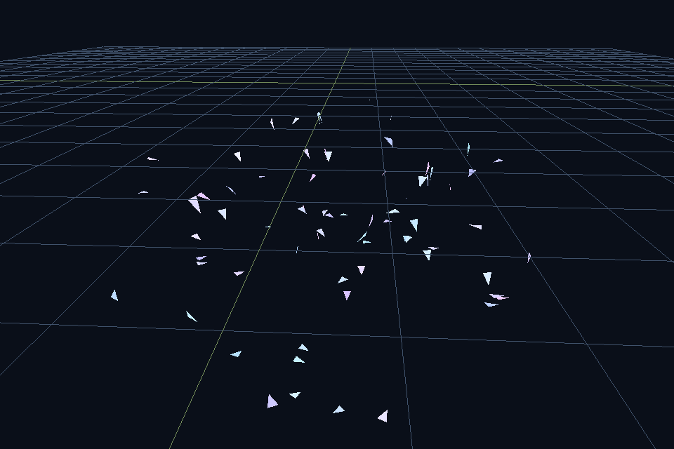

# breve

### Talk to a continuous 3D multi-agent world

**Describe a scene in English. Watch gravity, mass, and flocks come alive in the browser.**  
A modern revival of [Jon Klein’s breve](https://github.com/jonklein/breve) (~2000–2015) — lightweight 3D multi-agent / artificial-life simulation for teaching, demos, and playful science.

<p align="center">
  <a href="https://github.com/jonklein/breve"></a>
  
  
  
</p>

<p align="center">
  
</p>

<p align="center"><em>Classic breve spirit · Python 3 engine · browser UI · optional Grok scene builder</em></p>

---

## Why this exists

| You want… | Typical tools | **breve** |
|-----------|---------------|-----------|
| Continuous **3D** agents, not grids | NetLogo / Mesa | Native fit |
| Something **lighter than Unity** | Unity ML-Agents | `pip` + browser |
| **See gravity & mass** in minutes | Raw physics engines | Curriculum demos + chat |
| **Describe a world** in plain language | Copy-paste LLM code | Safe JSON scenes + live 3D |

This is **not** a game engine or a robotics stack. It is a **sandbox for continuous 3D multi-agent / ALife thinking** — the gap between NetLogo and Unity.

> **Original work © Jonathan Klein.** This repository is a community **fork and revival**. See [Credits](#credits--attribution).

---

## 60-second start (the product)

```bash
git clone https://github.com/imcmurray/breve.git
cd breve
python3 -m venv .venv && source .venv/bin/activate   # Windows: .venv\Scripts\activate
pip install -e ".[webai]"
breve-web
```

Open **http://127.0.0.1:8765**

- A **gravity demo auto-plays** (no empty canvas, no API key)
- Try curriculum chips: **Gravity · Stairs · Wrecking ball · Flock**
- Optional: paste an [xAI API key](https://console.x.ai) and **describe a new world** in chat
- **Share** copies a link with the scene encoded (`/?s=…` or `/?example=…`)

Deploy: **[DEPLOY.md](DEPLOY.md)** · Docker included.

---

## What you can do

### Browser (recommended)

| Feature | What it does |
|---------|----------------|
| **Autoplay demos** | Instant visual proof of continuous 3D agents |
| **Curriculum chips** | Teaching path: mass, stairs, impact, flocking |
| **Chat → scene** | Grok builds a **safe JSON** scene (never arbitrary `exec`) |
| **Refine** | “Make gravity stronger”, “add a heavy ball” |
| **Live 3D** | Orbit, zoom, pause, reset |
| **Share** | Send a URL; others see the same world |

### Python API (classic spirit)

```python
import breve
from breve.engine import Engine, set_engine

set_engine(Engine())

class Hello(breve.Control):
    def iterate(self):
        print("Hello, world!")
        super().iterate()

Hello().run(steps=5)
```

Subclass `Control` / `Mobile`, implement `iterate` and collision handlers — the mental model from original breve.

### Desktop demos

```bash
pip install -e ".[dev,viz]"
pytest -q
python demos/swarm.py --viz
python demos/bouncy.py --viz
python demos/gravity.py --viz
```

| Demo | Idea |
|------|------|
| `swarm` | Boids / emergence |
| `bouncy` | Gravity arcs + mass tiers |
| `gravity` / stairs scene | Mixed weights on structure |
| `stack` / tower scene | Impact under gravity |
| `gatherers` | Collision-driven pickup |

More: [`demos/INDEX.md`](demos/INDEX.md)

---

## Architecture (safe AI)

```text
  English prompt  ──►  Grok (xAI)  ──►  scene JSON  ──►  breve engine
                                              │
                                              ▼
                                    browser three.js view
```

- Model output is **declarative JSON only** (schema in `python/breve/scene.py`)
- Physics / flocking run in **Python** on the server
- The browser **renders** streamed state (WebSocket)

CLI alternative: `breve-ai "…" --viz` (see below).

---

## Install options

```bash
# Web + AI scene builder
pip install -e ".[webai]"

# Local OpenGL demos
pip install -e ".[viz]"

# AI CLI only
pip install -e ".[ai]"

# Tests
pip install -e ".[dev]"
pytest -q
```

```bash
export XAI_API_KEY=xai-...     # https://console.x.ai
# optional: cp .env.example .env
breve-web                      # http://127.0.0.1:8765
breve-ai "flock of cyan birds" --viz
```

---

## Repository layout

```text
python/breve/     Modern engine, physics, AI, web app
web UI           →  breve-web  (FastAPI + three.js)
demos/            Scriptable demos
scenes/           Curriculum JSON (autoplay / share)
legacy/           Original C++ / steve / Python 2 tree (museum)
REVIVAL.md        Roadmap & design decisions
NOTICE.md         Attribution requirements
DEPLOY.md         Docker / Fly / Railway notes
```

---

## Status

| Area | State |
|------|--------|
| Python 3 agent API | yes |
| Rigid-body physics (spheres / AABBs) | yes |
| Flocking / kinematic agents | yes |
| Browser UI + autoplay + share | yes |
| AI scene builder (xAI Grok) | yes |
| Joints / Walker / Rapier | planned |
| steve language | legacy only |

Roadmap: **[REVIVAL.md](REVIVAL.md)**

---

## Credits & attribution

### Original breve

Created by **[Jonathan Klein](https://github.com/jonklein)** — *the breve simulation environment* for decentralized systems and artificial life in continuous 3D.

- Upstream: **[github.com/jonklein/breve](https://github.com/jonklein/breve)**
- Historical site: [spiderland.org](http://www.spiderland.org/)
- This repo is a **GitHub fork** of that work so lineage stays visible

### Citation

If you use breve in research or teaching, please cite the original work, e.g.:

> Klein, J. (2002). *BREVE: a 3D environment for the simulation of decentralized systems and artificial life.* Proceedings of the Eighth International Conference on Artificial Life (Artificial Life VIII).

Machine-readable: [`CITATION.cff`](CITATION.cff) · human summary: [`NOTICE.md`](NOTICE.md)

### This revival

Modern engine, packaging, browser product, and AI scene composer by revival contributors. Not an official product of the original author unless they say otherwise.

---

## License

**GPL-2.0-or-later** — see [`LICENSE`](LICENSE) and [`GPL.txt`](GPL.txt).

Original breve © Jonathan Klein and contributors.  
Revival additions © revival contributors (same license family for compatibility).

---

## Contributing

Issues and PRs welcome on the revival fork. Prefer:

1. Demo / curriculum polish that teaches a concept in &lt; 30 seconds  
2. Web UX that shortens time-to-“aha”  
3. Physics and agent API fidelity to the classic *spirit* without requiring 2007 toolchains  

Keep `legacy/` intact as historical source.

---

<p align="center">
  <strong>Open the web UI. Watch a world start. Then talk one into existence.</strong><br />
  <code>breve-web</code> → <a href="http://127.0.0.1:8765">http://127.0.0.1:8765</a>
</p>
